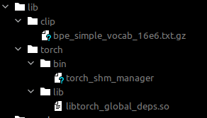
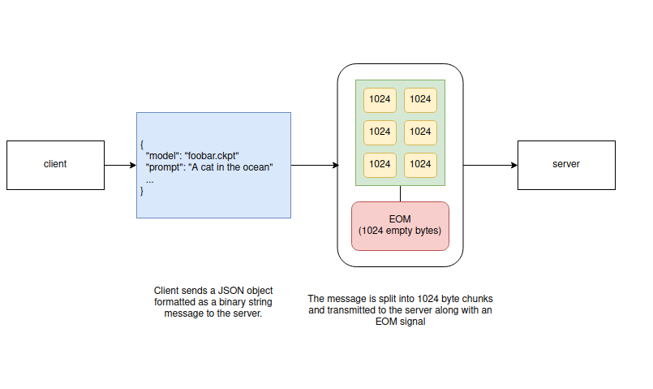

# RunAI

Run AI allows you to run a threaded Stable Diffusion low level python socket 
server.

---

## Features

- Offline friendly - works completely locally with no internet connection (must first download models)
- **Sockets**: handles byte packets of an arbitrary size
- **Threaded**: asynchronously handle requests and responses
- **Queue**: requests and responses are handed off to a queue
- **Auto-shutdown**: server automatically shuts down after client disconnects
- Does not save images or logs to disc

---

## Limitations

- Data between server and client is not encrypted
- Only uses float16 (half floats)

---

## Installation

First run `sh bin/install.sh` to install the required models. These will be
placed in `~/stablediffusion`. See [Stable Diffusion directory structure](#stable-diffusion-directory-structure) for more information.

## Docker

Easiest method
 
1. [Install docker](https://docs.docker.com/engine/install/)
2. [Install nvdia-container-runtime](https://nvidia.github.io/nvidia-container-runtime/)
3. `sudo apt install nvidia-container-toolkit`
4. Copy `daemon.json` to `/etc/docker/daemon.json` (if you already have a daemon.js file in that directory, just copy the contents)
5. `docker-compose up`

----

### Docker commands

**Enter bash**

```
docker-compose run --service-ports app -c "/bin/bash bash"
```

**Update requirements**

```
docker-compose run --service-ports app pip3 install -r /app/requirements.txt
```

**Build RunAI**

```
docker-compose run --service-ports app /app/bin/buildlinux.sh
```

Runai server will be in the `dist` directory.

**Start the server**

```
docker-compose run --service-ports -v /home:/home app python3 server.py
```

**Clean up**

```
docker-compose run --service-ports app /app/bin/clean.sh
```
---

### More commands

- Build and start the services `docker-compose up`
- Stop and remove all services `docker-compose down`
- Rebuild all services `docker-compose build`
- List all running containers `docker-compose ps`
- View the output from containers `docker-compose logs`
- Execute a command in a running container `docker-compose exec <service> <command>`
- Replace <service> with the name of the service defined in the docker-compose.yml file, and <command> with the command you want to run.

---

## Bare metal

1. [Install CUDA Toolkit 11.7](https://developer.nvidia.com/cuda-11-7-0-download-archive?target_os=Linux&target_arch=x86_64)
2. [Install miniconda](https://docs.conda.io/en/latest/miniconda.html)
3. Activate environment ``
4. conda activate runai
5. Install requirements `pip install -r requirements.txt`

Create a lib folder in the root of the project:

`mkdir -r lib/torch`

Copy the following into `lib/torch/`:

- `lib/torch/bin/torch_shm_manager`
- `lib/torch/lib/libtorch_global_deps.so`

Your directory structure may differ, but it will likely look something like this:

```
/home/<user>/miniconda3/envs/ksd-build/lib/python3.10/site-packages/torch/bin/torch_shm_manager
/home/<user>/miniconda3/envs/ksd-build/lib/python3.10/site-packages/torch/lib/libtorch_global_deps.so
```



- git
- conda
- a cuda capable GPU

Build the server
```
./bin/buildlinux.sh
```
The standalone server will be in the `dist` directory

Run the server
```
conda activate runai
python server.py
```

---

## Request structure

Clients establish a connection with the server over a socket and send a JSON
object encoded as a byte string split into packets. An EOM (end of message)
signal is sent to indicate the end of the message.




The server assembles the packets, decodes the JSON object and processes the
request. Once processing is complete the server will send a response
back to the client.

It is up to the client to reassemble the packets, decode the byte string to JSON 
and handle the message.

---

## Client

For an example client, take a look at the [connect.py file](https://github.com/w4ffl35/krita_stable_diffusion/blob/master/krita_stable_diffusion/connect.py) in the Krita Stable Diffusion [Plugin](https://github.com/w4ffl35/krita_stable_diffusion) which uses this server.

---

## Stable Diffusion directory structure


This is the recommended and default setup for runai

### Linux

Default directory structure for runai Stable Diffusion

#### Base models

These models are required to run Stable Diffusion

- **CLIP** files for CLIP
- **CompVis** safety checker model (used for NSWF filtering)
- **openai** clip-vit-large-patch14 model

```
 ├── ~/stablediffusuion
    ├── CLIP
    ├── CompVis
    │   ├── stable-diffusion-safety-checker
    ├── openai
        ├── clip-vit-large-patch14
```

#### Diffusers models

These are the base models to run a particular version of Stable Diffusion.

- **runwayml**: Base models for Stable Diffusion v1
- **stabilityai**: Base models for Stable Diffusion v2

```
├── ~/stablediffusuion
   ├── runwayml
      ├── stable-diffusion-inpainting
      ├── stable-diffusion-v1-5
   ├── stabilityai
      ├── stable-diffusion-2-1-base
      ├── stable-diffusion-2-inpainting
```

#### Custom models

- **v1** should be a directory containing models using stable diffusion v1
- **v2** should be a directory containing models using stable diffusion v2

You may place diffusers folders, ckpt and safetensor files in these directories.

```
├── ~/stablediffusuion
   ├── v1
   │   ├── <folder> (diffusers directory)
   │   ├── <file>.ckpt
   │   ├── <file>.safetensor
   ├── v2
       ├── <folder> (diffusers directory)
       ├── <file>.ckpt
       ├── <file>.safetensor
```

### Automatic1111 existing files

If you are using **Automatic1111** you can place your checkpoints in the
webui models folder as you typically would, however the directory structure
which includes v1 models separated from v2 models is required for now.

This allows you to use the same checkpoints for both **Automatic1111 webui**
and this server.

For example, if your `webui` directory looks like this

```
├── /home/USER/stable-diffusion-webui/models/Stable-diffusion
    ├── <some_checkpoint_file>.ckpt
    ├── <some_other_checkpoint_file>.ckpt
    ├── <some_other_checkpoint_file_v2>.ckpt
```

You would reorganize it like this:

```
├── /home/USER/stable-diffusion-webui/models/Stable-diffusion
    ├── v1
       ├── <some_checkpoint_file>.ckpt
       ├── <some_other_checkpoint_file>.ckpt
    ├── v2
       ├── <some_other_checkpoint_file_v2>.ckpt
```

You would then set BASE_DIR to `/home/USER/stable-diffusion-webui/models/Stable-diffusion`

---

### Build

First install `pyinstaller`

`pip install pyinstaller`

Then build the executable

```
./bin/buildlinux.sh
```

Test

```
cd ./dist/runai
./runai
```

This should start a server. 

[Connect a client to see if it is working properly](https://github.com/w4ffl35/krita_stable_diffusion)

---

## Running the server

`python server.py`

The following flags and options are available

- `--port` (int) - port to run server on
- `--host` (str) - host to run server on
- `--timeout` - whether to timeout after failing to receive a client connection, pass this flag for true, otherwise the server will not timeout.
- `--packet-size` (int) - size of byte packets to transmit to and from the client
- `--model-base-path` (str) - base directory for checkpoints
- `--max-client-connections` (int) - maximum number of client connections to accept

Example

```
python server.py --port 8080 --host https://0.0.0.0 --timeout
```

This will start a server listening on https://0.0.0.0:8080 and will timeout 
after a set number of attempts when no failing to receive a client connection.

---

### Request structure

Requets are sent to the server as a JSON encoded byte string. The JSON object
should look as follows

```
{
    TODO
}
```

---

### Model loading

The server does not automatically load a model. It waits for the client to send 
a request which contains a model path and name. The server will determine which
version of stable diffusion is in use and  which model has been selected 
to generate images. It will also determine the best model to load based on
the list of available types in the directory provided.

---

### Development notes


- `StableDiffusionRequestQueueWorker.callback` Handle routes and dispatch to functions
- `socket_server.message_client` Send a message to the client